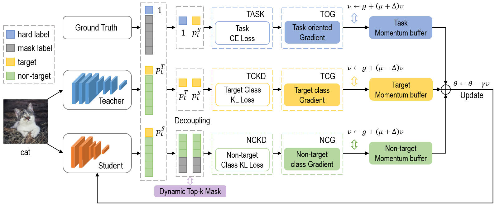

# DeepKD

This repo is the official implementation of [DeepKD: A Deeply Decoupled and Denoised Knowledge Distillation Trainer](https://arxiv.org/abs/2505.15133).

DeepKD is a novel knowledge distillation framework that addresses two fundamental challenges in knowledge transfer: (1) the inherent conflict between target-class and non-target-class knowledge flows, and (2) the noise introduced by low-confidence dark knowledge in non-target classes.

## Key Features

- **Dual-Level Decoupling**: Implements independent momentum updaters for task-oriented gradient (TOG), target-class gradient (TCG), and non-target-class gradient (NCG) components based on theoretical analysis of gradient signal-to-noise ratio (GSNR).

- **Adaptive Denoising**: Introduces a dynamic top-k mask (DTM) mechanism that progressively filters low-confidence logits from both teacher and student models, following curriculum learning principles.

- **Theoretically Grounded**: Provides rigorous analysis of loss components and optimization parameters in knowledge distillation, with momentum coefficients optimized based on GSNR characteristics.

- **Versatile Integration**: Seamlessly works with existing logit-based distillation approaches while consistently achieving state-of-the-art performance across multiple benchmark datasets.

## Performance

DeepKD demonstrates superior performance across various benchmarks including CIFAR-100, ImageNet, and MS-COCO, achieving higher GSNR and flatter loss landscapes compared to previous methods like vanilla KD, DKD, and DOT.


## Framework

<div style="text-align:center"></div>

## Usage

### Installation

Environments:

- Python ≥ 3.6
- PyTorch ≥ 1.8.0
- torchvision ≥ 0.10.0

Install the package:

```
pip install -r requirements.txt
python setup.py develop
```

### Training on CIFAR-100

- Download the [`cifar_teachers.tar`](<https://github.com/megvii-research/mdistiller/releases/tag/checkpoints>) and untar it to `./download_ckpts` via `tar xvf cifar_teachers.tar`.


1. For KD

```bash
# KD
python tools/train.py --cfg configs/cifar100/kd/resnet32x4_resnet8x4.yaml
# KD+Ours
python tools/train.py --cfg configs/cifar100/kd/resnet32x4_resnet8x4.yaml 
```

2. For DKD

```bash
# DKD
python tools/train.py --cfg configs/cifar100/dkd/resnet32x4_resnet8x4.yaml 
# DKD+Ours
python tools/train.py --cfg configs/cifar100/dkd/resnet32x4_resnet8x4.yaml
```
3. For MLKD

```bash
# MLKD
python tools/train.py --cfg configs/cifar100/mlkd/resnet32x4_resnet8x4.yaml
# MLKD+Ours
python tools/train.py --cfg configs/cifar100/mlkd/resnet32x4_resnet8x4.yaml
```

4. For CRLD

```bash
# CRLD
python tools/train.py --cfg configs/cifar100/crld/res32x4_res8x4.yaml
# CLRD+Ours
python tools/train.py --cfg configs/cifar100/crld/res32x4_res8x4.yaml
```

### Training on ImageNet

- Download the dataset at <https://image-net.org/> and put it to `./data/imagenet`

```bash
# KD+Ours
python tools/train.py --cfg configs/imagenet/r34_r18/deepkd_kd.yaml
# DKD+Ours
python tools/train.py --cfg configs/imagenet/r34_r18/deepkd_dkd.yaml
# MLKD+Ours
python tools/train.py --cfg configs/imagenet/r34_r18/deepkd_mlkd.yaml
# CRKD+Ours
python tools/train.py --cfg configs/imagenet/r34_r18/deepkd_crld.yaml 
```


## Object Detection on MS-COCO
Our implementation is built upon the [ReviewKD codebase](https://github.com/dvlab-research/ReviewKD).

## Installation

1. Install Detectron2:
   - Follow the official installation guide at https://github.com/facebookresearch/detectron2

2. Dataset Setup:
   - Download the [COCO dataset](https://cocodataset.org/#download)
   - Place the dataset in the `datasets/` directory

3. Pretrained Models:
   - Download pretrained weights from [ReviewKD releases](https://github.com/dvlab-research/ReviewKD/releases/)
   - Place the weights in the `pretrained/` directory
   - Note: The provided weights include both teacher models (from Detectron2's pretrained detectors) and student models (ImageNet pretrained weights)

## Training Commands
Train different model configurations using the following commands:
```
# Tea: R-101, Stu: R-18
python train_net.py --config-file configs/DEEPKD/DKD-R18-R101.yaml --num-gpus 4

# Tea: R-101, Stu: R-50
python train_net.py --config-file configs/DEEPKD/DKD-R50-R101.yaml --num-gpus 4

# Tea: R-50, Stu: MV2
python train_net.py --config-file configs/DEEPKD/DKD-MV2-R50.yaml --num-gpus 4

```

## Acknowledgement

We would like to express our sincere gratitude to the following open-source projects that have contributed to the development of DeepKD:

- [mdistiller](https://github.com/megvii-research/mdistiller) - A comprehensive knowledge distillation toolkit
- [Multi-Level-Logit-Distillation](https://github.com/Jin-Ying/Multi-Level-Logit-Distillation) - Implementation of multi-level logit distillation
- [logit-standardization-KD](https://github.com/sunshangquan/logit-standardization-KD) - Knowledge distillation with logit standardization


## Citation

If this repo is helpful for your research, please consider citing the paper:

```BibTeX
@misc{huang2025deepkddeeplydecoupleddenoised,
    title={DeepKD: A Deeply Decoupled and Denoised Knowledge Distillation Trainer}, 
    author={Haiduo Huang and Jiangcheng Song and Yadong Zhang and Pengju Ren},
    year={2025},
    eprint={2505.15133},
    archivePrefix={arXiv},
    primaryClass={cs.CV},
    url={https://arxiv.org/abs/2505.15133}, 
}
```